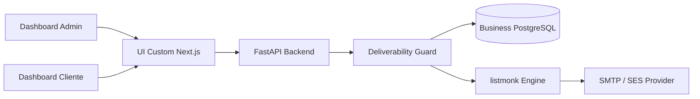
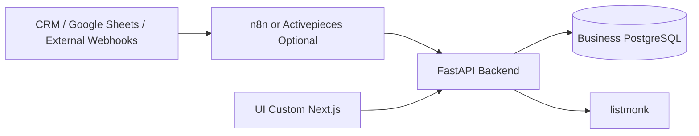

# Architecture V1

Source of truth: `project_handoff_v1.md`.

Planned auth and account-management contract: `docs/auth_contract_v1.md`.

## Overview

V1 is an installable, Docker-based Email AI Automation Platform skeleton. The product direction is a custom Next.js UI, FastAPI backend, Business PostgreSQL database, listmonk email engine, and SMTP / Amazon SES provider path. Mailpit is available only in dev/staging.

## Why FastAPI Is The Gatekeeper

FastAPI owns business rules, client isolation, send authorization, Deliverability Guard checks, usage tracking, suppression enforcement, and listmonk coordination. No email may be sent without backend authorization.

## Why listmonk Is Engine Only

listmonk handles operational email mechanics: lists, subscribers, technical campaigns, tracking, unsubscribe handling, and SMTP/provider integration. It does not own business truth, campaign product state, client limits, AI generation, or send authorization.

## Why UI Is Custom Next.js

The dashboard is a product surface, not an internal builder. A custom Next.js UI gives control over admin workflows, client dashboard UX, branding, and future product evolution. The UI displays data and sends requests to backend APIs only.

## Why n8n Is Outside Core V1

n8n can be useful later for CRM, Google Sheets, external webhooks, and client-specific automations. It is not core V1 because it would risk becoming a second business brain. If introduced later, it must call the backend and must not call listmonk or SMTP directly.

## Why Mailpit Is Dev/Staging Only

Mailpit captures email safely for inspection. It prevents accidental real sends during development and staging. It must not be used in production.

## Why PostgreSQL Business DB Is Source Of Truth

Business PostgreSQL stores customer-owned state: clients, users, campaigns, contacts, usage, suppression, provider events, blocked sends, and listmonk mappings. listmonk's data is operational and must not replace business truth.

## Included Tools

- FastAPI backend
- Custom Next.js frontend
- Business PostgreSQL
- listmonk
- SMTP / Amazon SES behind listmonk
- Mailpit for dev/staging
- MJML templates
- Minimal Python worker placeholder
- Docker and Docker Compose

## Optional Tools

- n8n or Activepieces as future integration layer through backend only
- Keycloak in a later auth milestone
- Celery if background task volume justifies it
- Metabase for internal read-only analytics later

## Excluded Tools

- Budibase as final dashboard
- Postal
- Rspamd
- Mautic
- Keila
- n8n as core V1
- Direct provider sending from backend as default V1 path
- Direct UI access to listmonk or PostgreSQL
