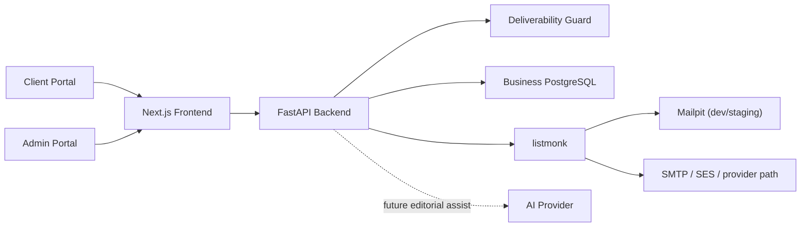

# Architecture V1

Source of truth: `project_handoff_v1.md`.

Planned auth and account-management contract: `docs/auth_contract_v1.md`.

## Overview

Sendwise remains a custom client/admin portal over a backend-controlled email-delivery stack.

## Product Direction

The admin portal is the only V1 operational surface for the guided campaign flow:

1. New campaign
2. Select client
3. Setup campaign
4. Create content or select template
5. Add/import recipients
6. Review and analyze
7. Simulate or request controlled send

The client portal remains read-only for campaign overview, detail, state, usage, blocked sends, and delivery metrics when available.

This milestone aligns the contracts to that direction without implementing the full product flow.

## Why FastAPI Is The Gatekeeper

FastAPI owns:

- trusted auth-to-client resolution
- admin-managed campaign creation and mutation rules
- validation of admin-selected `client_id`
- slot and limit enforcement
- review and Guard orchestration
- listmonk preparation and dispatch orchestration
- AI usage logging

No email may be simulated or dispatched without backend-controlled checks.

## Why Business PostgreSQL Is The Source Of Truth

Business PostgreSQL stores the customer-facing truth for:

- clients and access mappings
- campaigns and future wizard state
- contacts and campaign membership
- blocked sends and email logs
- future campaign slots
- future product templates
- future AI usage and review artifacts

listmonk data remains operational and must not replace business truth.

## Why listmonk Is Engine Only

listmonk handles:

- technical lists
- technical subscribers
- technical campaigns
- send execution mechanics
- unsubscribe/tracking mechanics

listmonk does not own:

- product campaign state
- slot policy
- template catalog truth
- AI generation
- send authorization

## Why Frontend Is Not A Trust Boundary

The frontend is a product surface only. It may render an admin wizard and client read-only dashboards, but it must not decide:

- `client_id`
- slot limits
- Guard outcomes
- review outcomes
- provider selection

## Why Campaign Slots Are Preferred

The previous single client-wide `email_limit_per_campaign` model is too coarse for admin-managed campaigns with different operational tiers.

Recommended direction:

- introduce admin-managed `campaign_slots`
- assign one slot to one campaign
- let Guard apply `slot.max_emails`

Compatibility remains necessary because current runtime still enforces:

- `clients.email_limit_per_campaign`
- `clients.max_campaigns`

## Why AI Is Editorial Assistance Only

AI should help the user write better email content, not act as an autonomous sender.

AI may:
- generate drafts
- suggest subject and preview text
- review copy risk
- propose alternatives

AI may not:
- authorize send
- bypass review or Guard
- assign slots
- decide `client_id`
- publish automatically

## Environment Rules

- Mailpit remains for dev/staging inspection only.
- `EMAIL_SENDING_ENABLED` remains the kill switch for real dispatch.
- SES remains controlled and outside this milestone's implementation scope.
- no new worker or Celery architecture is introduced here.

## Included Systems

- Next.js frontend
- FastAPI backend
- Business PostgreSQL
- Deliverability Guard
- listmonk
- Mailpit in dev/staging
- template rendering pipeline

## Future Contract Systems

- `email_templates`
- admin campaign wizard endpoints
- client campaign detail, stats, and events completion
- editorial AI-assist endpoints

These are proposed product contracts, not implemented runtime features in this milestone.
